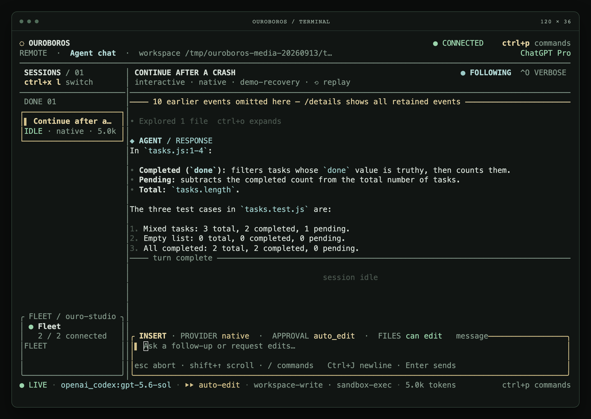
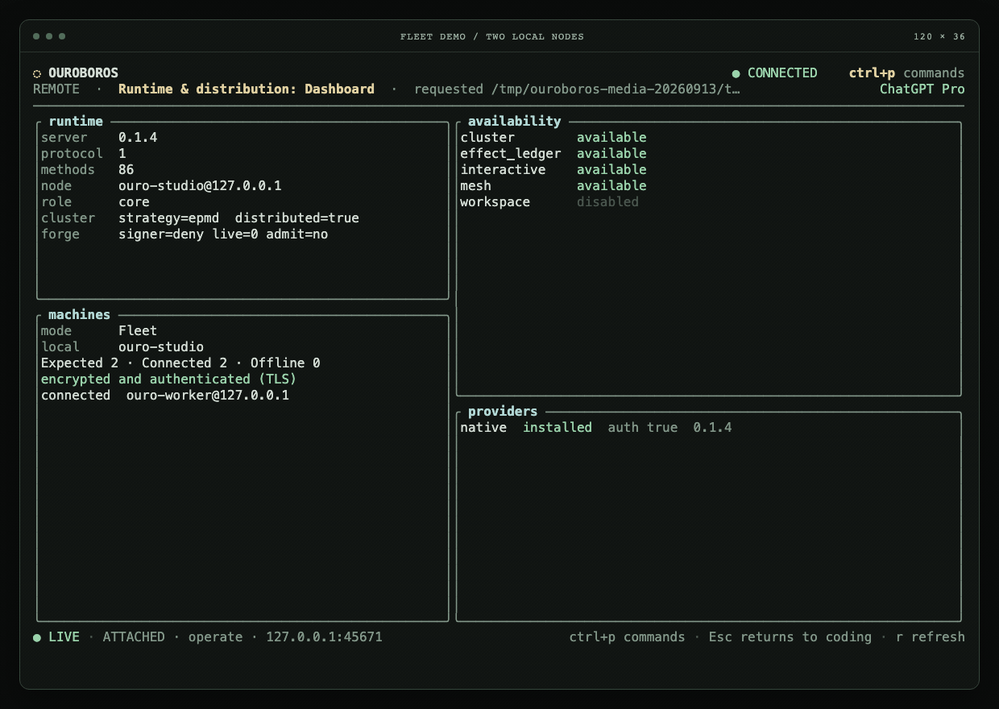
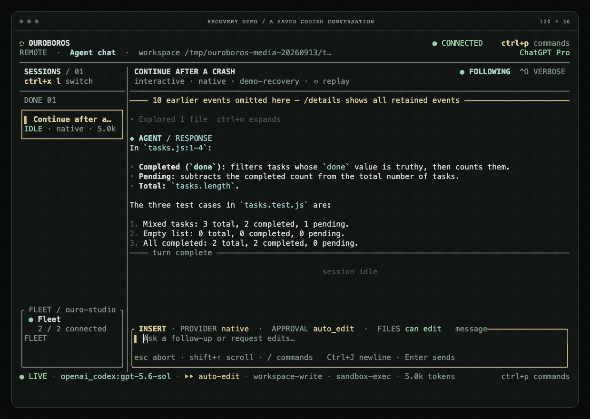
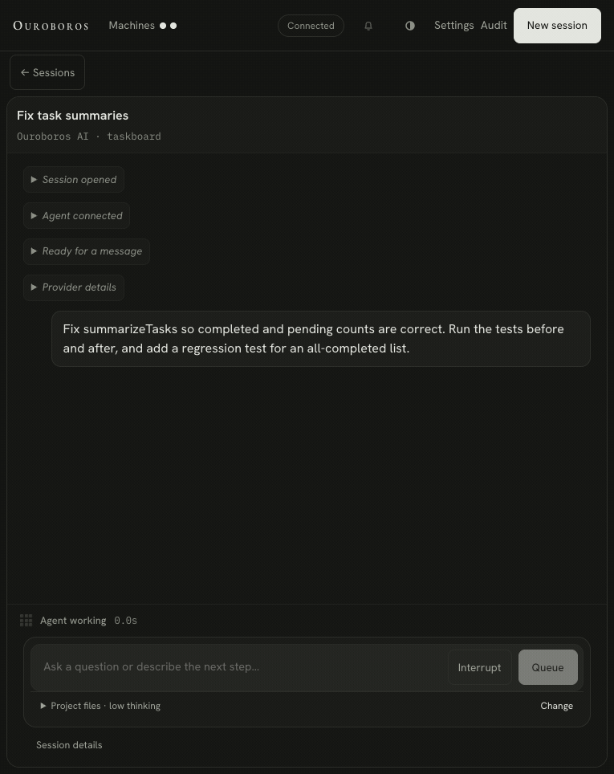

<p align="center">
  
</p>

# Ouroboros

Ouroboros is an experimental runtime for long-running AI coding work. It gives
you one place to start, supervise, inspect, and resume coding agents on a single
machine or across a small cluster of them.

It is different from the coding agents it borrows its table stakes from in exactly
four ways: sessions are durable BEAM state; subagents run across machines on Erlang
distribution; containment is authority; and the runtime improves itself under human
gates. Everything kept serves one of those. [The core reduction](docs/proposals/core.md)
is the record of what was cut in September 2026 to make that true.

## What it does

- Runs coding sessions from a terminal or a web browser on an in-process tool loop,
  `Ouroboros.Provider.Native`, which reaches OpenAI (a ChatGPT sign-in or an API key),
  Anthropic and xAI models directly. It is the only provider.
- Keeps every session as durable state: history, replay, rewind, fork and handoff,
  cancellation, and recovery after its coordinator, the node, or the machine goes away.
- Spawns subagents on other machines of a BEAM cluster. Each child holds its own git
  worktree lease, and its progress arrives in the parent's transcript.
- Runs the model's shell under macOS `sandbox-exec` or Linux bubblewrap with an honest
  label, or refuses to run it, and runs third-party and forged code as WebAssembly
  components whose authority is their import list.
- Asks before sensitive actions through allow/ask/deny rules, hooks, and approvals, and
  records every effect in a ledger that is an authority boundary, not telemetry.
- Improves itself: a session forges a component, promotion rests on recorded evidence, a
  human signs, merges and promotes, and one benchmark says whether the change was an
  improvement ([docs/SELF.md](docs/SELF.md)).

## See it work

The terminal client, connected to a real coding session:



[Web UI screenshot](website/public/demos/web-session.png) ·
[Full desktop web UI](website/public/demos/web-desktop.png) ·
[Fleet overview](website/public/demos/fleet.png)

<details>
<summary>Fleet management — a worker disconnects and rejoins (11s)</summary>



</details>

<details>
<summary>Agent recovery — a process crashes, the conversation continues (15s)</summary>



</details>

<details>
<summary>Coding session — reproduce, fix, and test (22s)</summary>



</details>

Captured from the development build; pauses are shortened. The fleet uses two nodes
on one Mac. Recovery shows one agent-process crash while idle; automatic resume is
bounded to one attempt per coordinator incarnation. [Capture notes, limits, and MP4s](website/public/demos/README.md).

## Project status

Ouroboros is under active development. It is a working research project, not a
finished commercial product.

The runtime, the terminal client, the web interface, cluster placement, and the
WebAssembly lane are implemented and tested locally. Some production concerns remain:
high-availability state, partition handling, signing custody outside the cluster's
trust domain, and a VM boundary around the shell and the build. Tag-based binary
distribution builds and tests each supported platform before publication.
Review the documented limits
in [ARCHITECTURE.md](docs/ARCHITECTURE.md), "Safety boundaries", before relying on
Ouroboros for sensitive or unattended work.

## Quick start

Install the latest stable release on macOS or GNU/Linux with:

```sh
curl -fsSL https://github.com/monocursive/ouroboros/releases/latest/download/install.sh | bash
ouro
```

This installs a checksum-verified binary to `~/.local/bin`. The runtime is embedded;
Elixir and Rust are not needed. The [installation and release guide](docs/RELEASING.md)
covers platform requirements, upgrades, and installing any older version from
[GitHub Releases](https://github.com/monocursive/ouroboros/releases).

Starting with version 0.1.3, use `ouro update --check` to
check for a newer stable version, and `ouro update` to install it. Finish active
work and run `ouro stop`, then `ouro`, to activate the new embedded runtime.
Version 0.1.2 and older binaries need one installer rerun to acquire the command.

To build from source, install Elixir 1.20, Erlang/OTP 29, Rust 1.95, `make`, Git, and
a native C/C++ toolchain. Build on the machine that will run it. See the
[developer preview guide](docs/PREVIEW.md) for platform qualification, first-use checks,
and known limitations.

```sh
mix deps.get
make ouro
./tui/target/release/ouro
```

`make ouro` builds the runtime and embeds it in the `ouro` terminal
client. Open it from the project you want to work on, describe a task, and press
Enter. If needed, connect ChatGPT; your submitted task starts after sign-in.
For a guided first task, press F2 to explore the project, edit the prompt, then
press Enter. The selected folder and file permissions are visible before you start;
`/options` opens advanced setup. Three keys are worth learning first: `ctrl+p` lists every
command, `ctrl+x` is the leader the shortcuts hang from, and `?` shows the whole key map —
all three, and every key in them, are rebindable from `[keys]` in `config.toml`
([docs/TUI.md](docs/TUI.md)).

To use the browser interface:

```sh
./tui/target/release/ouro web
```

On a session page, `⌘K` (`ctrl+K` elsewhere) opens the command palette — every verb this
surface can run, and only the ones it can run right now — and `?` lists the keys. A
transcript downloads as text or NDJSON from the palette's "Export this transcript"
([docs/WEB.md](docs/WEB.md)).

Model access is a ChatGPT sign-in by default. An API key selects a direct lane instead:
`OUROBOROS_NATIVE_MODEL=openai:<model>` with `OPENAI_API_KEY`, or `anthropic:<model>` /
`xai:<model>` with the vendor's key, or the key saved from the web new-session page.

To use a **Grok coding subscription**, including SuperGrok Heavy, sign in on the computer
running Ouroboros with `grok login`, then select `grok:grok-4.6` in the web model picker
or start a session with `ouro new --model grok:grok-4.6`. Grok is used for sign-in;
Ouroboros calls the subscription endpoint directly and runs its own agent loop and tools.
The `xai:` prefix continues to use separately billed API keys.

Ouroboros reads the private `~/.grok/auth.json` OAuth credential on each request. Set
`OUROBOROS_GROK_AUTH_FILE` in the service environment if that file lives elsewhere.
Renew expired credentials with `grok login`; the web connection card has a Refresh
button. Ouroboros does not copy or rotate Grok's refresh tokens. An unavailable sign-in
fails explicitly, with no API-key fallback. Model access and subscription usage limits
remain controlled by xAI; API token prices are not shown as subscription charges.

xAI documents [subscription use in third-party agents](https://x.ai/news/grok-opencode)
and [direct calls using Grok sign-in](https://github.com/xai-org/grok-build/blob/main/crates/codegen/xai-grok-shell/README.md#using-authjson-for-api-access).

## A second machine

Ouroboros runs as one BEAM cluster: several machines, one trust domain, sessions and
subagents placed across it. There is no enrollment product. Install the same version of `ouro` on each machine,
copy one cluster-identity directory between them privately, and tell the first machine
about the second:

```sh
ouro fleet create --machine studio --host STUDIO_PRIVATE_ADDRESS      # first machine
ouro fleet create --from /path/to/copied/fleet --machine vps --host …  # second machine
ouro fleet members add vps --host VPS_PRIVATE_ADDRESS                 # first machine
ouro fleet status
```

[The cluster document](docs/FLEET.md) has the whole recipe, the environment a node
reads, and the boundary that matters: any node that completes the distribution handshake
holds full authority over every other one.

## Development

```sh
make dev       # run the terminal client from this checkout
make daemon-restart  # recompile/restart it; development sessions are retained
make web       # open the development web interface
make test      # run the full local test and formatting suite
```

Run `make help` for the complete command list.

## WebAssembly components

Ouroboros can run third-party code — hooks and capabilities — as WebAssembly components
instead of as processes with the ambient authority of the machine. A component's authority
is its import list, and the only import the runtime defines is a log line: no clock, no
filesystem, no network, and an import the host does not define fails to load. That is why a
hook shipped by a repository nobody trusts is allowed to run, while a shell hook from the
same file is not: a component can make a decision stricter, never looser.

There are two paths, and both start with `ouro wasm new`:

- **A hook** answers one lifecycle event with one verdict — deny a write, ask about a
  command, add context to a turn. It is declared in a workspace's `ouroboros.toml`.
- **A capability** is a signed, deployed component the runtime keeps: messages in, replies
  out, state of its own, restarted after a reboot. An operator signs it, deploys it, and can
  retire it without a rebuild.

```sh
make wasm                        # build the helper separately (make ouro includes it)
ouro wasm new my-guard --hook    # scaffold a project that builds
ouro wasm inspect my_guard.wasm  # what it declares, and whether this runtime would admit it
```

[The author guide](docs/WASM_GUIDE.md) is the fifteen-minute version of each path, the
payload and verdict contracts, every bound with its source, and how to operate a node that
runs them. [WASM.md](docs/WASM.md) is the design behind it.

## Documentation

- [Installation and releases](docs/RELEASING.md)
- [Changelog](CHANGELOG.md)
- [Architecture](docs/ARCHITECTURE.md)
- [Terminal client](docs/TUI.md)
- [Web interface](docs/WEB.md)
- [The cluster](docs/FLEET.md)
- [Traceability and audit](docs/AUDIT.md)
- [Session replay](docs/REPLAY.md)
- [WebAssembly components](docs/WASM_GUIDE.md)
- [Self-improvement](docs/SELF.md)
- [Benchmarks](docs/BENCHMARKS.md)
- [Protocol reference](docs/PROTOCOL.md)
- [The core reduction](docs/proposals/core.md), the plan and its status

## Contributing

Contributions are welcome. For substantial changes, open an issue first so the
scope and direction can be agreed before a large amount of work is done.

Keep pull requests focused, explain the problem being solved, and include
relevant tests and documentation. Contributors are responsible for reviewing
and validating everything they submit.

AI-generated pull requests are accepted. If AI materially contributed to a pull
request, disclose that in the description and explain what you personally
reviewed or tested. AI assistance does not lower the quality or verification bar.

I reserve the right to close any pull request, including an AI-generated one, at
any time and without prior warning or explanation. Submitting a pull request does
not guarantee review, feedback, acceptance, or continued maintenance.

## License

Ouroboros is available under the [MIT License](LICENSE). Copyright (c) 2026
Monocursive.
