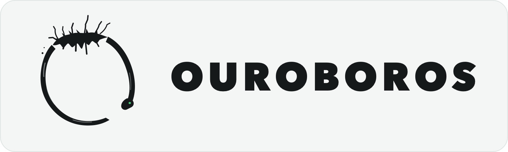

<p align="center">
  
</p>

# Ouroboros

Ouroboros is an experimental runtime for long-running AI coding work. It gives
you one place to start, supervise, inspect, and resume coding agents on a single
machine or across a small fleet.

The goal is to make agentic software development durable and accountable.
Sessions should survive ordinary failures, ask before sensitive actions, expose
what they changed, and remain under the operator's control.

## What it does

- Runs coding sessions from a terminal or web browser.
- Supports multiple model providers through one consistent workflow.
- Keeps durable session history, replay, cancellation, and recovery state.
- Coordinates subagents, teams, and dependency-based plans.
- Provides approvals, permissions, workspace controls, cost visibility, and an
  effect ledger.
- Connects trusted machines into a fleet while keeping work attached to the
  machine that owns it.

## Project status

Ouroboros is under active development. It is a working research project, not a
finished commercial product.

The core runtime, terminal client, web interface, agent coordination, and fleet
support are implemented and tested locally. Some production concerns remain,
including high-availability state, partition handling, external signing custody,
and proven release distribution. Review the documented limits before relying on
Ouroboros for sensitive or unattended work.

## Quick start

Building from source currently requires Elixir 1.20, Erlang/OTP 29, Rust 1.95,
and `make`.

```sh
make ouro
./tui/target/release/ouro
```

The first command builds the runtime and embeds it in the `ouro` terminal
client. Open it from the project you want to work on, describe a task, and press
Enter. If needed, connect ChatGPT; your submitted task starts after sign-in.
For a guided first task, press F2 to explore the project, edit the prompt, then
press Enter. The selected folder and file permissions are visible before you start;
`/options` opens advanced setup.

To use the browser interface:

```sh
./tui/target/release/ouro web
```

Model access requires credentials or a supported provider subscription. The
exact setup depends on the provider you choose.

To manage other trusted machines, install the built `ouro` on your `PATH`, then:

```sh
ouro fleet create --machine studio --host STUDIO_PRIVATE_ADDRESS
ouro fleet service install
ouro fleet service start
ouro fleet add user@server --machine server --host SERVER_PRIVATE_ADDRESS
ouro fleet status
```

SSH enrollment activates recovery on the destination and checks its connection to the
running owner. Different operating systems or CPUs require a matching signed release;
release signing still needs provisioning. See [fleet setup](docs/FLEET.md) for private
networking, revocation, recovery requirements, and the shared BEAM trust boundary.

## Development

```sh
make dev       # run the terminal client from this checkout
make web       # open the development web interface
make test      # run the full local test and formatting suite
```

Run `make help` for the complete command list.

## WebAssembly components

Ouroboros can run third-party code — hooks and capabilities — as WebAssembly components
instead of as processes with the ambient authority of the machine. A component's authority
is its import list, and the only import the runtime defines is a log line: no clock, no
filesystem, no network, and an import the host does not define fails to load. That is why a
hook shipped by a repository nobody trusts is allowed to run, while a shell hook from the
same file is not: a component can make a decision stricter, never looser.

There are two paths, and both start with `ouro wasm new`:

- **A hook** answers one lifecycle event with one verdict — deny a write, ask about a
  command, add context to a turn. It is declared in a workspace's `ouroboros.toml`.
- **A capability** is a signed, deployed component the runtime keeps: messages in, replies
  out, state of its own, restarted after a reboot. An operator signs it, deploys it, and can
  retire it without a rebuild.

```sh
make wasm                        # build the containment helper (nothing else builds it)
ouro wasm new my-guard --hook    # scaffold a project that builds
ouro wasm inspect my_guard.wasm  # what it declares, and whether this runtime would admit it
```

[The author guide](docs/WASM_GUIDE.md) is the fifteen-minute version of each path, the
payload and verdict contracts, every bound with its source, and how to operate a node that
runs them. [WASM.md](docs/WASM.md) is the design behind it.

## Documentation

- [Architecture](docs/ARCHITECTURE.md)
- [Agent experience](docs/AGENT_EXPERIENCE.md)
- [Terminal client](docs/TUI.md)
- [Web interface](docs/WEB.md)
- [Fleet setup](docs/FLEET.md)
- [Computer use](docs/COMPUTER_USE.md)
- [WebAssembly components](docs/WASM_GUIDE.md)
- [Protocol reference](docs/PROTOCOL.md)
- [Distribution](docs/DISTRIBUTION.md)

## Contributing

Contributions are welcome. For substantial changes, open an issue first so the
scope and direction can be agreed before a large amount of work is done.

Keep pull requests focused, explain the problem being solved, and include
relevant tests and documentation. Contributors are responsible for reviewing
and validating everything they submit.

AI-generated pull requests are accepted. If AI materially contributed to a pull
request, disclose that in the description and explain what you personally
reviewed or tested. AI assistance does not lower the quality or verification bar.

I reserve the right to close any pull request, including an AI-generated one, at
any time and without prior warning or explanation. Submitting a pull request does
not guarantee review, feedback, acceptance, or continued maintenance.

## License

Ouroboros is available under the [MIT License](LICENSE). Copyright (c) 2026
Monocursive.
